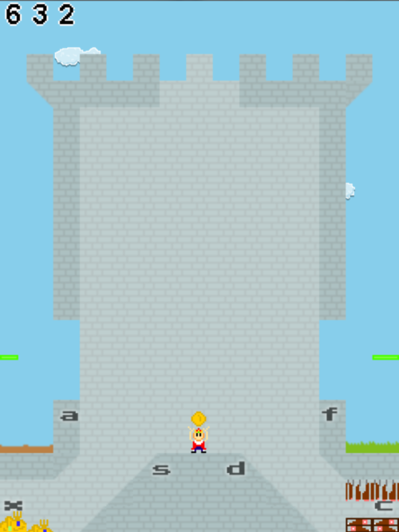

The Aberrant Gerent
===

Competition Entry for The Arbitrary Game Jam #2 (TAG)

Built in about 8 hours! (+ some polish time afterwards)

You are the King! Unfortunately, your kingdom is restless. The nobles are fickle and greedy and, as always, the peasants are just pesky and asking for things like food and basic human rights. Use your divine right (apparently just gold and meat dropping from the sky) to build your wealth and keep your kingdom happy.

Controls:

- a: throw to peasants
- s: throw to treasure room
- d: throw to meat storage
- f: throw to nobles
- x: dispatch knight to treasure room
- c: dispatch knight to meat storage
- m: mute/unmute
- p: pause
- q: quit